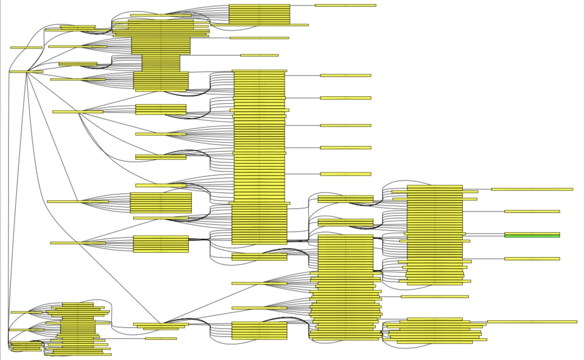

# RStarSolve - Spaghetti Code Experiment for System 2 Thinking

Basically a complex, weird experiment to test an idea. What if we used GPT-4 to help small models through a solution space. Please keep in mind this can cost a lot in API costs.

The goal of uplaoding the code had more to do with inspecting the code itself, and seeing the outputs than givign something people can run. I know most of it is spaghetti code, and mostly everyone will find this uselesss.

 
## Project Overview

The primary goal was to construct a meaningful answer path by:

- Generating potential solution steps (incomplete completions of random temperatures) from smaller GGUF format models.
- Obtaining evaluative guidance from GPT-4 to rank these solutions.
- Progressively building upon promising solution paths using a modified A* search algorithm.


It searches through a solution space and takes a long time to answer your question. However, throughout testing, found that random temeratures, sampling one of n incomplete paths tend to give good answers.

Below is an example of how it navigates through a solutioin space.


For a clearer examples, I would recommend checking out the Example folder with Pdf, dot file and csv. More examples are included too, about a 100 I guess. 

This was just an experiment. There is no real world application to this.

However, there are 2 possibilties:

Using learnings for synthetic data generation that has been evaluated step by step.

Or real-time step by step verification in LLMs.

## Dependencies

- `openai` - The official OpenAI API client for Python.
- `graphviz` - A Python library for creating visual representations of graphs.
- `pandas` - An open-source data analysis and manipulation tool.
- Custom libraries:
  - `llama_cpp` - A C++ binding for OpenAI's smaller models.
  - `r_star_search` - The backbone algorithm of this project.

## Setup and Execution

1. Clone the repository:

    ```shell
    git clone https://github.com/your-repo/rstarsolve.git
    ```

2. Install the required dependencies:

    ```shell
    pip install -r requirements.txt
    ```

3. Install llama_cpp and configure for your system/gpu.

4. Add your OpenAI API key and path to the GGUF model in the `main()` function of the `r_star_search.py`.

5. Run the algorithm:

    ```shell
    python r_star_search.py
    ```

## Generating New Solutions

To initiate the problem-solving process:

1. Edit the `query` variable in the `main()` function with the problem statement.
2. Execute the script as outlined in the Setup and Execution section.

## Results and Analysis

- Data generated from each search run are saved as CSV files.
- Visual graphs representing the search space are saved as PDFs.
- The framework handles goal realization and failure scenarios by categorizing completions and providing a comprehensive summary.

## Experimentation and Adaptation

RStarSolve is intended to be experimental, allowing for variations in the search algorithm's parameters and the possibility of further refinements. Users are encouraged to modify the heuristics, change model paths, and experiment with different settings to observe variations in performance and output quality.

## Contributions

Your contributions and suggestions are welcome. Please fork the repository, make your changes, and submit a pull request.

## License

This project is licensed under the [MIT License](LICENSE.md).

## Disclaimer

This project is a proof-of-concept and experimental by nature. It was just an exploration and has no real world use case.

---

